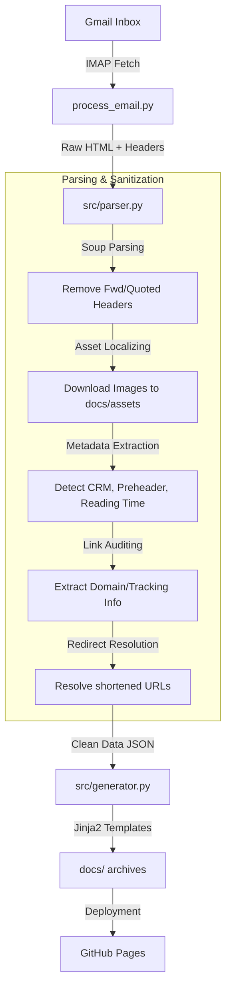

# 📬 Newsletter Archiver

An automated DevOps solution that captures incoming newsletters from Gmail, sanitizes them, and archives them as a static, responsive website hosted on GitHub Pages. The pipeline runs every 30 minutes via GitHub Actions.

---

## 🏗️ Technical Architecture & Data Flow

### Pipeline Overview

```
Gmail Inbox → IMAP Fetch → process_email.py → Parser → Generator → docs/ → GitHub Pages
```

### Granular Data Pipeline



---

## 🛠️ Component Map

| Component | File Path | Responsibility |
| :--- | :--- | :--- |
| **Orchestrator** | `process_email.py` | Main entry point. Handles Gmail auth, IMAP fetching, and triggers parsing/generation. Supports `--regen-only` and `--check-new` flags. |
| **IMAP Client** | `src/imap_client.py` | `EmailFetcher` class. IMAP connection, header/full message fetching, label-based search. |
| **Parser** | `src/parser.py` | `EmailParser` class. BeautifulSoup logic, image localization, tracking pixel detection, link metadata extraction (domain/tracking), redirect resolution. |
| **Generator** | `src/generator.py` | Jinja2 rendering. Creates `index.html` and individual viewer files. Handles asset copying. |
| **Viewer UI** | `templates/viewer.html` | Responsive dashboard for emails. Fixed sidebar, mobile simulator, link interaction logic (Spotlight, Overlays). |
| **Theme & UX** | `src/assets/js/main.js` | Client-side logic for theme toggling, search filtering, and "Smart Inversion" dark mode. |
| **Manual Injector** | `injector.py` | Streamlit app for out-of-band archival. Fixes lazy-loading and relative paths. |
| **Worker** | `src/worker.js` | Cloudflare serverless function for live viewer operations. |

---

## 🔧 Setup & Installation

### Prerequisites

- Python 3.12+
- Gmail account with App Password enabled

### Installation

```bash
# Create virtual environment
python -m venv .venv && source .venv/bin/activate  # macOS/Linux
# or: .venv\Scripts\activate  # Windows

# Install dependencies
pip install -r requirements.txt
```

### Environment Variables

Required secrets (set in GitHub Repo Secrets or local `.env`):

| Variable | Description | Default |
| :--- | :--- | :--- |
| `GMAIL_USER` | Gmail address | - |
| `GMAIL_PASSWORD` | Gmail App Password | - |
| `GMAIL_LABEL` | Target Gmail label | `Github/archive-newsletters` |

### Gmail Setup

1. Enable IMAP in Gmail settings
2. Create an App Password (Google Account → Security → 2-Step Verification → App passwords)
3. Create a label (e.g., `Github/archive-newsletters`) and filter incoming newsletters to it

---

## 🚀 Usage

### Command-Line Options

```bash
# Run full pipeline (fetches new emails from Gmail)
GMAIL_USER=you@gmail.com GMAIL_PASSWORD=app_password python process_email.py

# Force re-generate all existing archives
FORCE_UPDATE=true python process_email.py

# Re-render all viewer HTML from existing metadata (no IMAP, no image download)
python process_email.py --regen-only

# Quick-check for new emails (CI optimization)
# exits 0 = new emails found, exits 2 = nothing new
python process_email.py --check-new

# Manual injector (Streamlit UI for one-off uploads)
streamlit run injector.py

# Debug IMAP connection
python debug_gmail.py
```

### CI/CD

The GitHub Actions workflow (`.github/workflows/check_mail.yml`) runs automatically:

- **Schedule**: Every 30 minutes (`*/30 * * * *`)
- **Manual trigger**: `workflow_dispatch` with `force_update` boolean input
- **Optimization**: `--check-new` skips pipeline if no new emails
- **Deployment**: Commits `docs/*` changes via `stefanzweifel/git-auto-commit-action@v5`

---

## 🧠 Key Technical Concepts

### 1. Smart Inversion Dark Mode

Instead of complex CSS re-theming of unknown email HTML, we apply a global filter to the email iframe:

```css
filter: invert(1) hue-rotate(180deg);
```

**Spotlight Problem**: Shadows and highlights are inverted. We use "Pre-inverted" CSS variables in `viewer.html` so that when the filter is applied, they flip back to the intended colors (e.g., purple inverts to green highlights).

### 2. Multi-Zone Link Cards

Links are parsed into structured objects:

- **Header**: Index, Clean Domain, Tracking Tag
- **Body**: Anchor text
- **URL Zone**: Monospace URL + clipboard interaction with visual feedback

### 3. Dynamic Badge Overlays

Since email HTML is sandboxed in an iframe, link numbering badges are rendered in the **parent** window using absolute positioning calculated via `getBoundingClientRect()`.

**Clipping Logic**: Badges are hidden if the target link scrolls out of the iframe viewport.

### 4. Deterministic Email IDs

Each email gets a 12-char SHA-256 ID from `subject|date|message-id` for skip logic.

### 5. JSON Injection Safety

In `generator.py`, `</script>` is escaped to `<\/script>` inside embedded JSON before being marked `Markup`-safe to prevent template injection.

---

## 📁 Utility Scripts

| Script | Purpose |
| :--- | :--- |
| `apply_changes.py` | Applies bulk template/generator changes to existing archived viewers without re-running IMAP pipeline |
| `apply_base_target.py` | Injects `<base target="_blank">` into all existing `docs/*/index.html` files so links open in new tabs |
| `debug_gmail.py` | Standalone IMAP connection debugger — lists labels and message counts |
| `test_parser.py` | Ad-hoc parser test script for checking parse output on local HTML files |
| `backfill_audit_data.py` | Backfills audit metadata for existing archives |

---

## 🧪 Testing & Verification

### Playwright Testing (Before Committing)

Always test changes with Playwright before pushing:

```javascript
// Navigate to viewer page and test link clicks
// Use browser_run_code to click links and verify popup opens
async (page) => {
  await page.waitForSelector('#emailFrame');
  const iframe = page.frameLocator('#emailFrame');
  const link = iframe.locator('a[href="https://example.com"]').first();
  const popupPromise = page.waitForEvent('popup', { timeout: 5000 });
  await link.click();
  const popup = await popupPromise;
  return { opened: popup !== null, url: popup?.url() };
}
```

### Local Preview

Playwright blocks `file://` URLs. Run a local server:

```bash
cd docs && python3 -m http.server 8765
```

---

## 🎨 Contributing Guidelines

### CSS Architecture

- Use `var(--vp-c-*)` and `var(--text-*)` variables from the getinside Design System
- Key tokens: `#0aaa8e` brand primary (light), `#6AE7C8` mint accent, `#F7F6F3` light bg, `#1b1b1f` dark bg
- After editing `src/assets/css/style.css`, copy to `docs/assets/css/style.css` (auto-done on pipeline run)
- Viewer-specific overrides live in `.viewer-layout .viewer-content` blocks (~line 1315 in style.css)

### Parser Changes

When adding new metadata:

1. Update `EmailParser` in `src/parser.py` first
2. Ensure returned dict keys match Jinja2 template expectations in `templates/viewer.html`
3. **Never pass URLs via `onclick="{{ url | tojson }}"`** — `tojson` produces double-quoted strings that break HTML attribute parsing. Use `data-url="{{ url }}"` and read `btn.dataset.url` in JS.
4. **Link target="_blank"**: The parser injects `<base target="_blank">` into email HTML via `inject_base_target()` so links open in new tabs.

### Template Updates

- Maintain JS-based sidebar logic in `templates/viewer.html`
- Be careful with variable escaping when injecting JSON into `<script>` tags
- Device mockup Chrome HTML structure lives in `#deviceFrame` with `.device-mockup[data-mode="mobile|tablet|desktop"]` selectors
- Iframe sandbox must include `allow-popups-to-escape-sandbox` for link clicks to work

### CSS Gotchas

- **Generic `header` selector** has `margin-bottom: 32px` — override with `.viewer-layout .viewer-header { margin-bottom: 0; }` to remove unwanted gaps
- **Mobile/Tablet borders**: Use `border-width: 3px` for clearer device outlines in light mode
- **Light mode devices**: Mobile/tablet use same light color scheme as desktop (no dark chrome override)

### Asset Isolation

All archived images MUST be saved to `docs/<id>/` or `docs/assets/` — never referenced from `src/`.

### Remote Configuration

- **Single remote**: `getinside` → `https://github.com/getinside-ops/archive-news.git`
- Always push with `git push getinside main`
- No `origin` remote — remove if it appears: `git remote remove origin`

---

## 📦 Dependencies

```
jinja2>=3.0,<4.0
beautifulsoup4>=4.12,<5.0
requests>=2.31,<3.0
lxml>=4.9,<6.0
streamlit>=1.35,<2.0
python-dotenv>=1.0,<2.0
```

---

## ⚖️ Legal

- **Author**: Benoît Prentout
- **License**: MIT
- Contents remain the property of their respective authors (technical demonstration)
